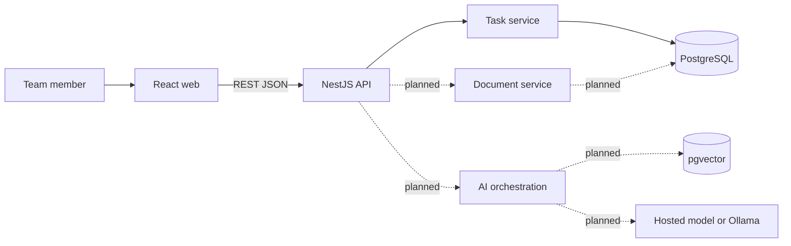

# ExaMate AI — Hướng dẫn teammate và backlog phát triển

## Thành viên và vai trò

- **Tài** phụ trách chính frontend, trải nghiệm người dùng và phần trình bày.
- **Thắng** phụ trách chính backend, dữ liệu, AI/RAG và deployment.
- Hai người có thể đổi vai trò nếu kỹ năng thực tế phù hợp hơn.
- Người không code task vẫn phải review và giải thích được luồng chính.

## 1. ExaMate AI là gì?

ExaMate AI là một web workspace dành cho nhóm sinh viên làm đồ án. Sản phẩm giải quyết hai vấn đề:

1. Quản lý các task và bằng chứng phát triển của nhóm.
2. Hỏi đáp trên một tập tài liệu môn học hoặc tài liệu project đã được kiểm soát.

Đây không phải chatbot hỏi gì cũng trả lời. Khi hoàn thiện, AI chỉ được phép trả lời dựa trên nội dung tìm thấy trong tài liệu đã upload, phải đưa ra citation và phải báo "không đủ bằng chứng" nếu không tìm thấy nguồn phù hợp.

### Người dùng chính

- **Thành viên nhóm:** quản lý task, upload tài liệu và hỏi yêu cầu môn học/project.
- **Giảng viên hoặc reviewer:** xem luồng demo, citation, kết quả evaluation và bằng chứng kỹ thuật.

### Demo cuối kỳ dự kiến

1. Mở workspace và xem task của nhóm.
2. Upload hoặc chọn một tài liệu đã xử lý.
3. Đặt một câu hỏi về yêu cầu trong tài liệu.
4. Nhận câu trả lời kèm nguồn và mở được đoạn nguồn.
5. Đặt một câu không có trong tài liệu và nhận kết quả "không đủ bằng chứng".
6. Cho thấy task vẫn hoạt động khi model AI bị tắt hoặc gặp lỗi.

## 2. Nghiệp vụ cốt lõi

### 2.1. Quản lý task — đã có baseline

Một task hiện gồm:

- `title`: tên công việc, từ 3 đến 160 ký tự;
- `owner_name`: người phụ trách, có thể để trống;
- `status`: `todo`, `in_progress` hoặc `done`;
- `due_date`: hạn hoàn thành, có thể để trống;
- `evidence_type`: loại bằng chứng cần nộp, có thể để trống.

Luồng đang chạy được:

```text
React form -> POST /api/tasks -> NestJS validation -> PostgreSQL -> React cập nhật danh sách
```

Các API hiện có:

| Method  | Endpoint                | Công dụng                             |
| ------- | ----------------------- | ------------------------------------- |
| `GET`   | `/api/health`           | Kiểm tra API và database              |
| `GET`   | `/api/tasks`            | Lấy danh sách task                    |
| `POST`  | `/api/tasks`            | Tạo task mới                          |
| `PATCH` | `/api/tasks/:id/status` | Đổi trạng thái task                   |
| `GET`   | `/api/assistant/status` | Cho biết AI đã được cấu hình hay chưa |

### 2.2. Quản lý tài liệu — chưa triển khai

MVP nên hỗ trợ **PDF trước**, chưa cần làm đồng thời PDF, DOCX và PPTX.

Một document dự kiến có:

- tên file;
- media type;
- storage key nội bộ;
- trạng thái `pending`, `processing`, `ready` hoặc `failed`;
- thời gian tạo và cập nhật.

Business rule đề xuất:

- Chỉ nhận PDF trong MVP.
- Giới hạn dung lượng ban đầu: 10 MB/file.
- Không dùng trực tiếp đường dẫn do client gửi lên làm storage key.
- Chỉ document có trạng thái `ready` mới được dùng để hỏi đáp.
- Khi xử lý thất bại, lưu trạng thái `failed` và thông báo dễ hiểu.

### 2.3. Xử lý tài liệu và retrieval — chưa triển khai

Luồng dự kiến:

```text
PDF -> extract text -> chunk text -> create embedding -> store in pgvector
Question -> create query embedding -> retrieve top chunks -> return evidence
```

Mỗi chunk phải giữ được:

- document ID;
- vị trí chunk;
- nội dung;
- số trang nếu trích xuất được;
- embedding;
- thông tin cần thiết để dựng citation.

### 2.4. AI Assistant có citation — chưa triển khai

Business rule đề xuất:

- Model chỉ được gọi từ backend.
- API key không bao giờ gửi xuống browser hoặc commit vào Git.
- Câu hỏi chỉ dùng những chunk đã retrieval làm evidence.
- Câu trả lời phải theo structured output do backend kiểm tra.
- Citation phải trỏ tới chunk đang tồn tại.
- Không có evidence phù hợp thì trả `unanswerable`, không dùng kiến thức chung để đoán.
- Model timeout hoặc unavailable thì task management vẫn phải hoạt động.

### 2.5. Evaluation — mới có kế hoạch

Nhóm phải chạy ít nhất 10 trường hợp trong `docs/evaluation-plan.md`, gồm câu hỏi đúng, mơ hồ, không liên quan, không thể trả lời, prompt injection, output sai, timeout, model unavailable và citation sai.

Mỗi kết quả cần lưu:

- model và prompt version;
- corpus revision;
- expected và actual behavior;
- latency;
- pass/fail;
- nhận xét của reviewer.

## 3. Phạm vi MVP và phần không làm

### Phải có

- Một workspace cho nhóm hai người.
- Task management có persistence.
- Upload và xử lý ít nhất một loại tài liệu.
- Hỏi đáp RAG có citation.
- Safe fallback khi không có bằng chứng hoặc model bị lỗi.
- 10 evaluation cases.
- Docker Compose chạy được và triển khai được trên một VM.
- Test, sơ đồ kiến trúc, AI usage log và contribution evidence.

### Chưa làm trong bản đầu

- Multi-organization hoặc role-based access phức tạp.
- Agent tự chạy nhiều bước hoặc nhiều tools.
- Chat realtime.
- Native mobile app.
- Thanh toán hoặc social feed.
- Kubernetes hoặc microservices.
- Nhiều model provider cùng lúc.

Nếu một ý tưởng mới không trực tiếp giúp demo MVP, hãy đưa nó vào backlog sau môn học.

## 4. Trạng thái project ở cuối tuần 3/8

### Đã hoàn thành

- React task workspace và các UI state cơ bản.
- NestJS API cho task với DTO validation.
- PostgreSQL persistence và pgvector extension.
- Dockerfiles và Docker Compose cho web, API, database.
- Health check cho API/database.
- Test, typecheck và production build cơ bản.
- AI status placeholder để chỉ rõ AI chưa được cấu hình.

### Chưa hoàn thành

- Document API và upload UI.
- PDF extraction, chunking và embedding.
- Vector retrieval.
- LLM adapter và endpoint hỏi đáp.
- Citation UI và citation validation.
- Chạy thật 10 evaluation cases.
- Deploy lên VM.
- Slide, backup demo và bộ câu hỏi vấn đáp.

Không đánh giá tiến độ bằng số lượng file. `node_modules` và `dist` là file sinh tự động; phần sản phẩm cốt lõi còn nhiều việc để hai thành viên thực hiện.

## 5. Kiến trúc cần hiểu



Project là **modular monolith**: một frontend, một backend API và một database. Không tách microservices trong phạm vi môn học.

### File map quan trọng

| Vị trí                                           | Vai trò                                       |
| ------------------------------------------------ | --------------------------------------------- |
| `apps/web/src/App.tsx`                           | Giao diện và luồng task hiện tại              |
| `apps/web/src/api.ts`                            | Các lời gọi từ React tới REST API             |
| `apps/api/src/main.ts`                           | Bootstrap API, validation và CORS             |
| `apps/api/src/app.module.ts`                     | Đăng ký controller/service của backend        |
| `apps/api/src/tasks/`                            | DTO, controller, service và type của task     |
| `apps/api/src/database/database.service.ts`      | Kết nối PostgreSQL                            |
| `apps/api/src/assistant/assistant.controller.ts` | Hiện chỉ có status placeholder                |
| `infra/postgres/init/001_init.sql`               | Schema task, document, chunk và evaluation    |
| `compose.yaml`                                   | Chạy web, API và database bằng container      |
| `docs/`                                          | Kế hoạch, kiến trúc, evaluation và bằng chứng |

Không chỉnh trực tiếp `node_modules`, `dist` hoặc `*.tsbuildinfo`.

## 6. Cách chạy project lần đầu

### Clone và cài dependency

```bash
git clone https://github.com/franz08hmt/New-Tech.git
cd New-Tech
npm install
```

### Cách đơn giản nhất: chạy toàn bộ bằng Docker

```bash
docker compose up --build
```

Kiểm tra:

- Web: `http://localhost:8080`
- API health: `http://localhost:8080/api/health`

### Chạy development mode

PowerShell:

```powershell
Copy-Item .env.example .env
docker compose up -d db
npm run dev:api
npm run dev:web
```

Kiểm tra:

- Web: `http://localhost:5173`
- API: `http://localhost:3000/api`
- PostgreSQL host port: `55432`

### Verification trước khi tạo pull request

```bash
npm run format:check
npm run typecheck
npm test
npm run build
docker compose config
```

Nếu một lệnh thất bại, ghi lại command, error và cách tái hiện trước khi nhờ người còn lại hỗ trợ.

## 7. Git workflow cho nhóm hai người

Không phát triển trực tiếp trên `main`.

```bash
git checkout main
git pull origin main
git checkout -b feat/CM-XXX-short-name
```

Sau khi hoàn thành:

```bash
git add <cac-file-lien-quan>
git commit -m "feat(scope): mo ta ngan gon"
git push -u origin feat/CM-XXX-short-name
```

Sau đó tạo Pull Request và yêu cầu người còn lại review.

### Quy tắc branch

- `feat/CM-XXX-name`: tính năng mới.
- `fix/CM-XXX-name`: sửa lỗi.
- `docs/CM-XXX-name`: chỉ cập nhật tài liệu.
- Mỗi branch chỉ giải quyết một task chính.

### Pull Request phải có

- Task ID và mục tiêu.
- Những file chính đã thay đổi.
- Cách chạy hoặc test.
- Screenshot, response mẫu hoặc log phù hợp.
- Rủi ro hoặc phần chưa hoàn thành.
- Xác nhận không commit `.env`, API key, `node_modules` hoặc `dist`.

Không merge nếu người review chưa hiểu thay đổi hoặc chưa tái hiện được kết quả.

## 8. Backlog và phân chia đề xuất

Chỉ kéo một task sang `in_progress` khi dependency của nó đã hoàn thành. Owner code, reviewer kiểm tra và phải giải thích lại được task.

| ID     | Tuần | Task                                          | Owner  | Reviewer | Phụ thuộc       |
| ------ | ---- | --------------------------------------------- | ------ | -------- | --------------- |
| CM-001 | 4    | Clone, chạy và xác minh baseline              | Cả hai | Cả hai   | Không           |
| CM-002 | 4    | Vẽ lại và trình bày luồng tạo task            | Thắng  | Tài      | CM-001          |
| CM-003 | 4    | Một thay đổi nhỏ xuyên frontend–API–DB        | Tài    | Thắng    | CM-001          |
| CM-101 | 4    | Document module và API metadata/upload        | Thắng  | Tài      | CM-001          |
| CM-102 | 4–5  | Documents page và upload UI                   | Tài    | Thắng    | CM-101 contract |
| CM-201 | 5    | PDF text extraction và processing status      | Thắng  | Tài      | CM-101          |
| CM-202 | 5    | Chunking có source page                       | Thắng  | Tài      | CM-201          |
| CM-203 | 5    | Upload loading/error/failed UI                | Tài    | Thắng    | CM-102, CM-201  |
| CM-301 | 5–6  | Embedding adapter và pgvector retrieval       | Thắng  | Tài      | CM-202          |
| CM-302 | 6    | Assistant ask endpoint và structured output   | Thắng  | Tài      | CM-301          |
| CM-303 | 6    | Assistant UI và citation viewer               | Tài    | Thắng    | CM-302 contract |
| CM-304 | 6    | Unanswerable, timeout và unavailable fallback | Cả hai | Cả hai   | CM-302, CM-303  |
| CM-401 | 6–7  | Chạy và ghi lại 10 evaluation cases           | Tài    | Thắng    | CM-304          |
| CM-402 | 7    | Integration test và failure test              | Thắng  | Tài      | CM-304          |
| CM-403 | 7    | Deploy Docker Compose lên VM                  | Thắng  | Tài      | CM-402          |
| CM-404 | 7    | Kiểm tra demo flow và feature freeze          | Cả hai | Cả hai   | CM-401, CM-403  |
| CM-501 | 8    | Slide, architecture và backup demo            | Tài    | Thắng    | CM-404          |
| CM-502 | 8    | Luyện vấn đáp và giải thích code chéo         | Cả hai | Cả hai   | CM-404          |

## 9. Task đầu tiên dành cho teammate

Teammate chưa nên bắt đầu bằng AI integration. Hãy hoàn thành theo thứ tự:

### CM-001 — chạy baseline

Acceptance criteria:

- Clone được repository trên máy teammate.
- `npm install` hoàn thành.
- `docker compose up --build` chạy đủ ba service.
- Mở được web và `/api/health`.
- Tạo một task và đổi trạng thái thành công.
- Gửi lại screenshot và lỗi phát sinh nếu có.

### CM-002 — giải thích luồng hiện tại

Teammate cần trình bày được:

1. React gọi API ở file nào.
2. NestJS controller nhận request ở đâu.
3. DTO kiểm tra dữ liệu như thế nào.
4. Service chạy SQL ở đâu.
5. PostgreSQL trả dữ liệu ngược về giao diện thế nào.
6. Khi title chỉ có một ký tự thì request thất bại ở tầng nào.

Acceptance criteria: giải thích luồng trong 3–5 phút mà không chỉ đọc nguyên văn source code.

### CM-101 — task code đầu tiên đề xuất

Mục tiêu: xây dựng nền tảng backend cho document nhưng chưa làm embedding hoặc gọi AI.

Phạm vi:

- tạo document module/controller/service;
- định nghĩa DTO cho metadata và upload;
- giới hạn PDF và dung lượng 10 MB;
- lưu document với trạng thái `pending`;
- trả danh sách document;
- trả lỗi rõ ràng cho file không hợp lệ;
- thêm API tests.

Không nằm trong task này:

- PDF extraction;
- chunking;
- embedding;
- vector search;
- gọi LLM;
- thay đổi lớn giao diện.

Acceptance criteria:

- `POST /api/documents` nhận PDF hợp lệ và tạo record `pending`.
- `GET /api/documents` trả danh sách đã lưu.
- File sai loại hoặc quá dung lượng nhận HTTP 400/415 phù hợp.
- Không nhận đường dẫn storage từ client làm đường dẫn tin cậy.
- API test, typecheck và build đều pass.
- Tài review và giải thích lại được API contract.

## 10. Definition of Done cho mọi task

Một task chỉ được chuyển sang `done` khi:

- đáp ứng toàn bộ acceptance criteria;
- không có secret hoặc file sinh tự động trong commit;
- code tập trung vào đúng task, không refactor lan rộng;
- test/typecheck/build liên quan đã pass;
- có bằng chứng chạy thật;
- documentation hoặc API contract được cập nhật nếu cần;
- người còn lại đã review;
- cả owner và reviewer giải thích được quyết định chính và ít nhất một failure mode.

## 11. Khi bị vướng

Trước khi hỏi teammate hoặc dùng AI, hãy chuẩn bị bốn thông tin:

1. Mục tiêu đang làm và task ID.
2. Command hoặc thao tác đã chạy.
3. Error đầy đủ và file liên quan.
4. Điều đã thử và kết quả.

AI có thể hỗ trợ giải thích, gợi ý, review hoặc tạo bản nháp, nhưng nhóm phải kiểm tra lại bằng test và ghi vào `docs/ai-usage-log.md` nếu thay đổi đó đáng kể.

## 12. Câu hỏi cả hai phải trả lời được trước khi present

- Vì sao chọn modular monolith thay vì microservices?
- Vì sao model chỉ được gọi từ backend?
- RAG khác một chatbot thông thường ở điểm nào?
- Embedding và vector similarity được dùng ở bước nào?
- Citation được kiểm tra ra sao?
- Khi không có evidence thì hệ thống phản hồi thế nào?
- Khi model timeout, phần nào của hệ thống vẫn hoạt động?
- Dữ liệu nào nằm trong PostgreSQL và dữ liệu nào không được commit?
- Docker Compose tạo ra các service nào?
- Mỗi thành viên đã code, review và kiểm thử những phần nào?

---

**Điểm bắt đầu của Thắng:** hoàn thành CM-001 và CM-002, báo kết quả cho Tài, sau đó mới nhận CM-101 hoặc task tương đương đã được cả hai thống nhất.
