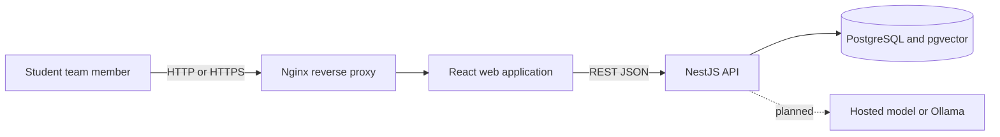
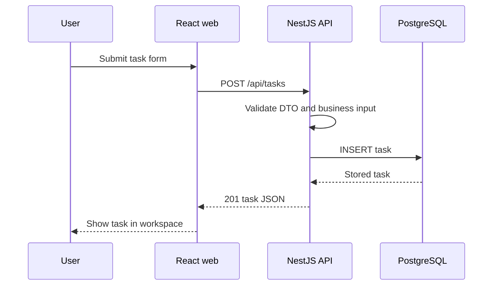
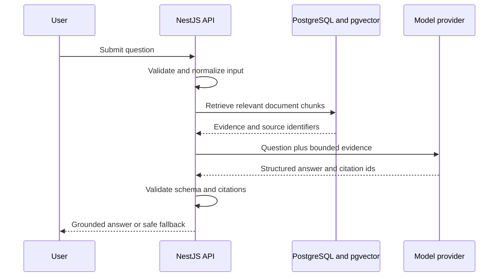

# CourseMate AI Architecture

## Architecture status at the end of Week 3

The project currently uses a modular monolith. The browser communicates with one NestJS API, and PostgreSQL stores the implemented task data. The database is initialized with `pgvector` support so the future retrieval index can be added without changing the deployment shape.

The local Docker Compose stack is verified. The Ubuntu virtual-machine deployment, document ingestion, retrieval pipeline, and model provider are still planned work.

## System context

## Implemented request flow: task creation

Implemented backend routes currently include health checks, task listing, task creation, and task status updates. The frontend handles loading, empty, success, and error states for this workflow.

## Planned grounded-answer flow

The planned flow must reject unsupported citations and must not present a generic model response as grounded evidence. Document text is untrusted input, so instructions found inside documents are treated as content rather than system commands.

## Deployment boundary

The current local deployment uses Docker Compose with a React/Nginx web container, a NestJS API container, and a PostgreSQL container. The target release will run the same Compose stack on an Ubuntu Server LTS virtual machine. Secrets will be supplied through environment variables and never embedded in the browser bundle.

## Main boundaries to explain in the presentation

- Browser to API: REST JSON and request validation.
- API to database: parameterized persistence and health checks.
- API to AI orchestration: backend-only credentials, bounded evidence, structured output validation, and failure handling.
- AI orchestration to source data: document chunks, vector similarity, and citation identifiers.
- Runtime to deployment: container health, reverse proxy routing, environment variables, and restart recovery.
