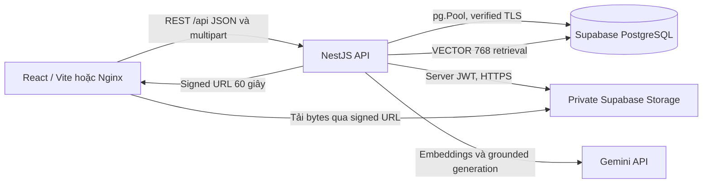
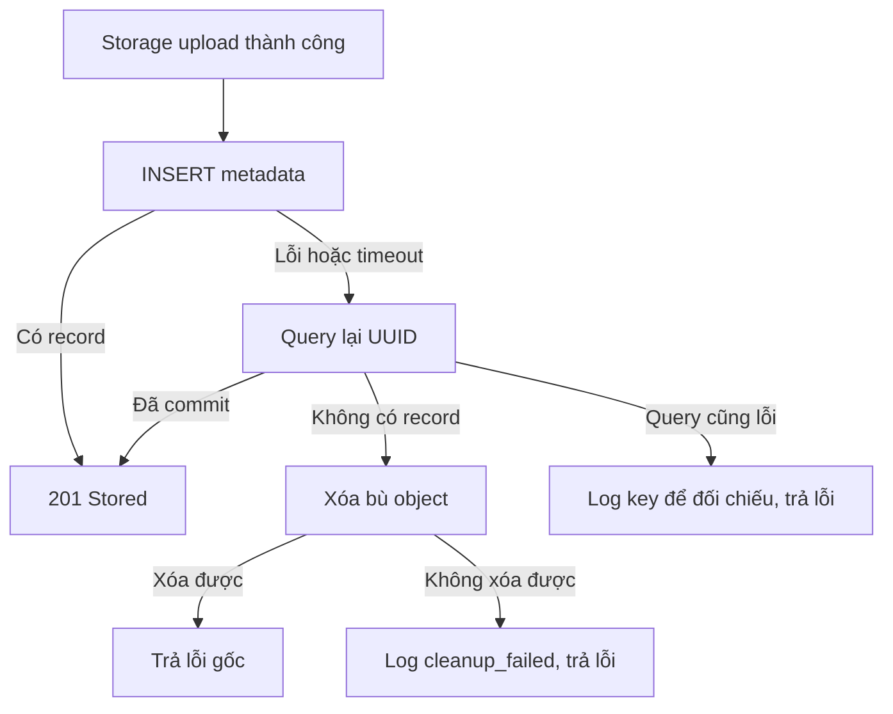

# Kiến trúc ExaMate — Tasks, Documents và RAG

Checkpoint 13/09/2026. Code Tasks/Documents đã triển khai; bằng chứng runtime cloud còn thiếu, xem [VERIFICATION.md](VERIFICATION.md).

```mermaid
flowchart LR
  Browser[React / Vite hoặc Nginx] -->|REST /api JSON và multipart| API[NestJS API]
  API -->|pg.Pool, verified TLS| DB[(Supabase PostgreSQL)]
  API -->|Server JWT, HTTPS| Storage[Private Supabase Storage]
  API -->|Signed URL 60 giây| Browser
  Browser -->|Tải bytes qua signed URL| Storage
  API -->|Embeddings và grounded generation| Gemini[Gemini API]
  API -->|VECTOR 768 retrieval| DB
```

Dev Vite proxy /api đến localhost:3000. Production web build tĩnh phục vụ bằng Nginx; proxy không đổi/lặp prefix. Main Compose gồm web/API, không DB local; compose.local-db.yaml chỉ dành DB test. Local web bind 127.0.0.1 vì workspace chưa authentication.

## Hai luồng nghiệp vụ

Task: TasksPanel.submit → useWorkspace.create → api.createTask → DTO/ValidationPipe → TasksService.create → parameterized INSERT → record RETURNING →201 → UI. PATCH status tương tự; UUID sai400, không tồn tại404. DATE lưu ngày YYYY-MM-DD, timestamps TIMESTAMPTZ.

Document: chọn File (selected) → upload multipart (uploading) → Nest giới hạn một PDF10MiB và kiểm tra extension/MIME/signature → Storage object key UUID → INSERT metadata →201 (stored/pending). Người dùng nhấn Index → backend claim trạng thái processing → tải bytes private → extract/chunk → Gemini embedding → transaction thay chunks → ready. Failed có thể retry; ready có thể re-index.

Assistant: câu hỏi → query embedding → pgvector lấy chunks `ready` qua ngưỡng (tùy chọn lọc `courseId`) → context có source ID → Gemini structured JSON → backend kiểm tra schema, source ID và inline marker → UI. Không có evidence thì trả `answerable:false` và không gọi generation. Citation click xin signed URL mới theo `documentId`; storage key không xuống browser.

```mermaid
flowchart TD
  Upload[Storage upload thành công] --> Insert[INSERT metadata]
  Insert -->|Có record| Stored[201 Stored]
  Insert -->|Lỗi hoặc timeout| Probe[Query lại UUID]
  Probe -->|Đã commit| Stored
  Probe -->|Không có record| Cleanup[Xóa bù object]
  Probe -->|Query cũng lỗi| Reconcile[Log key để đối chiếu, trả lỗi]
  Cleanup -->|Xóa được| Fail[Trả lỗi gốc]
  Cleanup -->|Không xóa được| Orphan[Log cleanup_failed, trả lỗi]
```

Delete: DB set deleting → Storage remove → DB DELETE →204. Lỗi giữ metadata/key, retry thực hiện lại; record đã không còn trả204. Không transaction PostgreSQL nào tự bao phủ Storage. Response mất sau ghi có thể dẫn đến retry duplicate nếu người dùng không reload đối chiếu.

## Ranh giới bảo mật và vận hành

- Private bucket bảo vệ object trực tiếp, không thay authorization NestJS. Chưa login/user isolation; demo dùng chung, local only.
- Backend legacy service_role key không xuất hiện trong VITE variables/bundle/log. Signed URL là quyền tải tạm thời, không log.
- Runtime pg role có thể là owner/bypass RLS; RLS/REVOKE trong migration bảo vệ Data API anon/authenticated, không tự cách ly truy vấn backend.
- Migration runner tracking/checksum/lock, mỗi migration transaction; áp dụng RLS/grants trước commit initial tables để tránh cửa sổ mở Data API. Giữ 001_init.sql, vector/pgcrypto chỉ cho compatibility schema.
- Health kiểm tra SELECT1 và timeout, storage:not_checked. Request logs có timestamp/level/id/method/path/status/duration, không body/query/token.
- UI giữ data/File/câu hỏi khi lỗi, có retry; thao tác index có khóa chống gửi trùng và trạng thái thật từ API.
- Test HTTP dùng compiled Nest với global prefix/validation/filter giống runtime; mock DB/Storage khác test DB riêng và khác demo Supabase thật.

Các trang academic vẫn có nhãn Example; Notes là local browser utility. RAG chưa có authentication, rate limit, streaming, persistence hội thoại hoặc kiểm chứng cloud thật.
