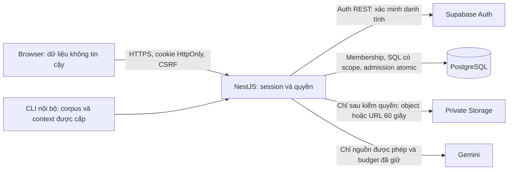

# Pilot có kiểm soát — thiết kế Chặng 0

Ngày 06/10/2026. **Đề xuất để Tài duyệt; chưa triển khai xác thực, quyền hoặc hạn mức.**
Hiện trạng và bằng chứng nằm trong [báo cáo khảo sát](pilot-stage-0-report.md).
Chỉ làm một workspace của nhóm. Thành viên có quyền đọc workspace đọc được
mọi tài liệu trong workspace; chưa có tài liệu riêng từng người. Không đăng ký
công khai, social login, public sharing, billing hoặc dashboard quản trị.

## 1. Ranh giới tin cậy

Authentication xác định người đang gửi request. Authorization xác định người
đó được làm gì trên workspace/nguồn cụ thể. UUID hợp lệ, tên hiển thị, UI ẩn nút,
JWT client decode và metadata người dùng tự sửa đều không cấp quyền.
Principal lấy từ Supabase Auth được backend xác minh; workspace pilot cấu hình
phía server; role đọc từ membership DB. Không nhận quyền từ body/header client.

Backend đang dùng PostgreSQL owner có BYPASSRLS và khóa Storage đặc quyền.
Private bucket chặn object công khai; không chặn một API chưa kiểm quyền ký URL.
RLS không hạn chế owner/BYPASSRLS như role thông thường. NestJS phải kiểm quyền
trước mọi tác dụng phụ. [Supabase RLS](https://supabase.com/docs/guides/database/postgres/row-level-security).

## 2. Session được đề xuất cho Chặng 1

Chọn backend session cookie; React không giữ access/refresh token trong
localStorage, sessionStorage hoặc URL. Không thêm npm dependency: dùng native
fetch gọi Auth REST được Supabase công bố, `pg`, NestJS/class-validator hiện có
và primitive chuẩn của Node. Không tự verify chữ ký JWT/hash mật khẩu.
Nếu adapter REST không đáp ứng được kiểm chứng an toàn, dừng triển khai và đề
xuất `@supabase/supabase-js` cho backend để Tài quyết định; chưa cài package.

- Đăng nhập email/password của tài khoản đã được quản lý cấp: backend gọi
  `/auth/v1/token?grant_type=password`; refresh bằng grant `refresh_token`;
  logout `/auth/v1/logout?scope=local`. `apikey` dùng publishable/anon key riêng
  được cấp; không thay khóa Storage hiện có bằng khóa Auth. Chỉ gọi origin
  Supabase HTTPS cấu hình cố định, không redirect theo upstream/client.
  [Auth OpenAPI](https://github.com/supabase/auth/blob/master/openapi.yaml).
- Mỗi protected request kiểm local session chưa revoked, idle/absolute expiry,
  rồi xác minh access token qua Auth `/user`. Lấy principal từ user trả về;
  kiểm khớp user đã gắn với session. Không cache kết quả Auth để đi qua outage.
  Auth/DB timeout, response sai shape hoặc thiếu config: fail closed 503,
  không rơi về quyền demo. [getUser](https://supabase.com/docs/reference/javascript/auth-getuser).
- Token đã được Auth kiểm chứng mới được đọc `session_id` ở backend và đối
  chiếu SELECT tham số hóa `auth.sessions(id,user_id,not_after)`. Yêu cầu session
  tồn tại, cùng principal, `not_after` chưa hết nếu có. Local expiry luôn được
  kiểm riêng. Đây không phải tin JWT decode độc lập. Cần người quản lý cấp
  SELECT đúng ba cột cho runtime role; nếu không cấp được, ranh giới thu hồi
  session này chưa đủ điều kiện nghiệm thu, không âm thầm bỏ kiểm tra.
  [Supabase sessions](https://supabase.com/docs/guides/auth/sessions).
- Cookie opaque dùng 32 byte random server; DB chỉ giữ SHA-256 của ID cookie.
  Access/refresh token lưu server trong bảng session private, mã hóa bằng
  AES-256-GCM có sẵn của Node: IV random 12 byte mới mỗi lần, tag 16 byte,
  AAD gắn session/version; key 32 byte server-only có key version/rotation.
  Không tạo thuật toán mật mã mới. Không lưu mật khẩu. Mất key thì yêu cầu
  đăng nhập lại, không giải mã với fallback. [Node 24 crypto](https://nodejs.org/docs/latest-v24.x/api/crypto.html).
- Defaults đề xuất: pre-login session 10 phút, idle 30 phút, absolute 8 giờ;
  access expiry dựa trên response Auth, không bịa giá trị. Refresh dưới khóa
  row session: một tiến trình thực hiện, re-check phiên bản sau khi lấy khóa,
  commit cặp token xoay mới trước khi dùng. Hai tab/request không dùng lại
  refresh token cũ; refresh uncertain do mất mạng không retry mù, yêu cầu
  xác minh lại/đăng nhập khi không phục hồi được một cách chắc chắn.
  FE refresh bằng POST có CSRF trước expiry hoặc sau yêu cầu refresh được
  backend phân loại rõ; chỉ tự gửi lại GET an toàn sau refresh. Chat/upload/
  write chưa có kết quả không tự retry để tránh double effect/provider calls;
  feedback vẫn retry theo idempotency đã có. Không cập nhật idle timestamp do
  polling/heartbeat vô hạn; gia hạn theo tương tác hợp lệ của người dùng.
- Cookie HTTPS: `__Host-examate_session`, HttpOnly, Secure, SameSite=Lax,
  Path=/, không Domain; đổi ID/CSRF sau login chống session fixation.
  HTTP IP máy chủ không là cấu hình pilot được chấp nhận. Dev HTTP chỉ cho
  origin localhost/loopback đã cấu hình và API bind loopback, cookie tên riêng;
  Auth/CSRF/guards vẫn bật. Không dùng NODE_ENV/AUTH_DISABLED làm bypass.
  [OWASP session](https://cheatsheetseries.owasp.org/cheatsheets/Session_Management_Cheat_Sheet.html).
- Logout revoke local session bền vững trước, xóa cookie và gọi Auth logout local;
  Auth outage vẫn giữ local revoked, báo chưa xác nhận upstream, không tuyên bố
  logout mọi thiết bị. Nếu DB không ghi được revocation thì không báo thành công:
  khóa UI, giữ khả năng retry, protected requests fail closed khi DB lỗi.
  JWT Supabase có thể còn hiệu lực tới expiry sau logout, nên thêm kiểm local
  revocation/auth.sessions; URL Storage đã cấp cũng có hạn riêng.
  [Giới hạn signout](https://supabase.com/docs/guides/auth/signout).

HTTP mới dự kiến: `GET /api/auth/session` (bootstrap/pre-login CSRF hoặc trạng
thái session), `POST /api/auth/login`, `/refresh`, `/logout`. Response chỉ trạng
thái, principal cần thiết, workspace/role được cấp, expiry và CSRF token cho
bootstrap; không trả access/refresh token.
Auth routes không miễn CSRF/throttle. Mã lỗi riêng: AUTH_REQUIRED, AUTH_INVALID,
SESSION_EXPIRED (401), WORKSPACE_ACCESS_DENIED (403), AUTH_UNAVAILABLE (503),
LOGIN_RATE_LIMITED (429). `GET /auth/session` bị lỗi không biến thành anonymous
đã xác minh. Membership tối thiểu ở Chặng 1 là cổng cấp quyền vào pilot;
matrix hành động và scope từng row triển khai Chặng 2.

React có state verifying/anonymous/authenticated_no_access/authenticated/expired/
unavailable, không load workspace khi đang verifying hoặc chưa được cấp quyền.
Reload bootstrap lại từ cookie; không persist chat. Expiry giữ draft của cùng
principal trong memory phía sau cổng khóa; login khác principal xóa dữ liệu cũ.
Logout xóa chat/draft/feedback đang soạn, cache, SourcePreview và dữ liệu session;
BroadcastChannel chỉ gửi sự kiện logout, không token. Khi focus tab kiểm session
lại; không tuyên bố mọi tab biết admin revocation ngay tức thì. Notes hiện dùng
key `examate-notes` chung: cần namespace theo principal/workspace, không tự nhận
notes legacy thuộc người vừa login; giữ legacy tách khỏi UI tới khi nhóm quyết
định chuyển. Không bổ sung persistence cho chat.

FE giữ Poppins/token màu/Heroicons 24 outline, semantic HTML/labels/fieldset,
focus-visible/status accessible, vùng bấm ít nhất 44px và reduced motion.
Không modal lồng nhau hoặc dangerouslySetInnerHTML; giữ Markdown/preview an toàn.
Browser desktop/375px cần bằng chứng riêng, không suy ra từ DOM tests.

## 3. CSRF, origin và login throttling

Synchronizer token 32 byte random gắn server session, cả pre-login và sau login.
Bootstrap trả CSRF token trong JSON no-store; FE giữ memory, gửi `X-CSRF-Token`
chỉ tới API cùng origin. Token không trong cookie/URL/log. So khớp server bằng
primitive constant-time chuẩn; kiểm token, Origin chính xác và session trước
write, logout, refresh, upload/process **và POST chat mọi mode**. Guard chạy trước
Multer/provider. Login cũng cần pre-session/token, không miễn vì chưa login.
Không dùng SameSite hoặc CORS làm lớp bảo vệ duy nhất.
[OWASP CSRF](https://cheatsheetseries.owasp.org/cheatsheets/Cross-Site_Request_Forgery_Prevention_Cheat_Sheet.html).

Prefer một HTTPS origin qua reverse proxy. CORS chỉ exact allowlist, credentials
được bật khi cần dev cross-origin; không wildcard. Reject Origin thiếu/null/sai
trên unsafe request của browser API; CLI HTTP dùng session/CSRF hợp lệ và Origin
được cấp, không có ngoại lệ debug. Fetch Metadata kiểm thêm khi có. Chỉ nhận JSON
cho JSON routes, multipart chỉ upload có CSRF header; không parse text/plain.
GET download hiện ký một grant tạm: cần session + read permission + CSRF header
và same-origin checks trước ký, client SourcePreview/Download dùng fetch đã có.
Protected responses no-store; health public sau này chỉ `{status}`, không config.

Throttle bền vững PG, atomic admission trước gọi Auth: đề xuất 5 login attempts/
email-key/15 phút và 20/IP/15 phút, có global cap 60/phút, Retry-After. Email/IP
làm key HMAC với secret server, không log giá trị; hết window mới reset, không
khóa account vô thời hạn. Rate-limit bootstrap để tránh tạo pre-session vô hạn,
TTL cleanup chỉ bảng session/throttle; upstream 429 giữ riêng. Không tin
X-Forwarded-For tùy ý: chỉ trust IP/subnet proxy do quản lý xác nhận, API không
expose trực tiếp; proxy phải ghi đè forwarding headers đáng tin cậy. Redirect
sau login chỉ page/hash nội bộ allowlist có sẵn, reject URL tuyệt đối/`//`.

## 4. Membership, scope và dữ liệu hiện hữu

`workspaces(id,status)`, `workspace_memberships(workspace_id,user_id,role,active)`;
unique (workspace,user), role whitelist manager/member/viewer, không tự enroll
authenticated. `PILOT_WORKSPACE_ID` cố định backend; chưa có giá trị được duyệt.
Membership được quản lý bằng quy trình SQL nội bộ có kiểm quyền quản lý; không
thêm public CRUD membership hoặc admin UI. Mỗi request đọc membership đáng tin
cậy; tác vụ nhiều bước kiểm lại trước provider/signing/write. Membership có thể
bị thu hồi khi một provider call đã nhận: không hứa thu hồi nội dung đã gửi.

| Hành động hiện có                               | manager | member | viewer |
| ----------------------------------------------- | ------- | ------ | ------ |
| Đọc workspace, tài liệu; Download/preview       | Có      | Có     | Có     |
| Hỏi ba mode trong hạn mức, summary/course_info  | Có      | Có     | Có     |
| Tạo/cập nhật task, exam, study plan, expense    | Có      | Có     | Không  |
| Upload/gán môn/index tài liệu                   | Có      | Có     | Không  |
| DELETE exam/study plan/expense/document hiện có | Có      | Không  | Không  |
| Feedback của chính answer đã nhận               | Có      | Có     | Có     |

Course chỉ có GET; task chưa có DELETE; không thêm CRUD để khớp bảng quyền.
Viewer được gửi feedback dù đó là write có chủ đích. Không có quyền đọc toàn
bộ feedback qua HTTP cho bất kỳ role nào trong phạm vi này.

Thêm workspace_id cho tasks/courses/exams/study_plans/expenses/documents và
feedback; document_chunks kế thừa scope qua document join. Danh sách, read,
lookup slug/filename, count/sum, update/delete, source links đều scope từ server.
Creation gán workspace server; courseId/documentId phải thuộc workspace đó.
UPDATE/DELETE WHERE id AND workspace, permission check cùng transaction khi cần;
không scope chỉ list. ID ngoài scope trả 404 chung, không lộ sự tồn tại/tên.

Retrieval: kiểm membership/course/document trước embedQuery; thêm workspace
predicate ngay trong CTE nearest trước ORDER BY/LIMIT. Giữ score/topK/minScore,
scan policy và validator. Summary/metadata/ingestion claim/downloadBuffer và
workspace-records mọi SELECT/count cùng scope; nguồn ngoài quyền không vào
context/response/citation. Storage nhận object key từ document đã được authorize,
không nhận key từ client. Kiểm quyền trước upload/delete/sign; private bucket và
TTL 60 giây giữ nguyên. URL đã cấp có thể dùng tới expiry sau revoke membership.
[Private buckets](https://supabase.com/docs/guides/storage/buckets/fundamentals).

Feedback hiện chỉ có client UUID, không chứng minh ownership. Chặng 2 bổ sung
server answer receipt: UUID qua header `X-Assistant-Answer-ID` được khai báo trong contracts,
ledger private lưu principal/workspace/request ID và hash snapshot chuẩn hóa,
không thêm lịch sử chat text. FE dùng UUID server cho lượt mới. Feedback kiểm
receipt thuộc principal/workspace, hash khớp lượt đó; retry vẫn cùng submission
key. Không tin ownership do client gửi. Snapshot vẫn `client_reported`; hash
không chứng minh facts/citation đúng. Feedback cũ user_id null/legacy_unattributed,
không suy đoán người gửi; chỉ CLI manager nội bộ chọn ID/bộ lọc trong workspace.
Candidate UNREVIEWED, không tự thành gold/PASS/FAIL; không sửa run/gold lịch sử.

## 5. Migration, quyền DB và rollback

Đã có 001–011; **012 là số kế tiếp tại snapshot này**, phải kiểm lại trước viết.
Chặng 1 dự kiến 012: workspace/membership gate, sessions/pre-sessions/throttle.
Chặng 2 dự kiến 013: scope/backfill/answer receipt/feedback ownership, constraints
và least-privilege policies. Chặng 3 dự kiến 014: usage/counters/reservations.
Tên/số là dự kiến, chưa tạo SQL. Dùng runner checksum hiện có, không sửa 001–011.

Trước backfill: quản lý xác nhận target Supabase, workspace UUID, auth.users UUID
của manager/member/viewer và nguồn dữ liệu nhóm thuộc workspace nào. Không lấy
owner_name/nickname làm principal. Thiếu các IDs: code/tests độc lập vẫn làm,
áp dụng migration/backfill phần phụ thuộc chờ dữ liệu; không cấp quyền mặc định.
Plan backfill transaction: kiểm mapping và số rows/quan hệ trước; thêm nullable
scope, gán đúng workspace đã duyệt kể cả document course_id null; giữ ID/bytes/
chunks/course association; validate FK/counts, chỉ NOT NULL sau khi không còn
unmapped rows; abort nếu có dữ liệu khác workspace chưa xác định. Dừng writes
trong maintenance window, không chạy demo cũ song song với scoped runtime.

Workspace FK ON DELETE RESTRICT để không cascade dữ liệu nhóm. Membership FK
auth.users RESTRICT: quản lý phải thu hồi/gỡ membership trước xóa user; session
user FK SET NULL khiến guard từ chối; feedback/usage/receipt user FK SET NULL
giữ lịch sử, không đổi snapshot. Scope FK của feedback RESTRICT, không source
FK cascade. Legacy ai_evaluations vẫn evaluation-only/private, không cần đổi
gold/case keys hay ghi rating vào passed.

Course quan hệ composite (workspace_id,course_id) tới courses(workspace_id,id),
unique index làm target, CHECK/scope tại service; nullable course vẫn hợp lệ.
Đề xuất FK mới RESTRICT; thao tác xóa course nếu tương lai có cần detach nullable
document/expense có chủ đích trước, không cascade exams/study plans. Hiện các FK
course→exams/study_plans CASCADE là risk đã thấy; thay constraint trong migration
mới, không sửa file cũ. Chunk→document CASCADE hiện có là dữ liệu derived, chỉ
đi theo DELETE document đã authorize manager; không thêm workspace/user cascade.

Tách migration owner khỏi role `examate_app` NOBYPASSRLS, không owner/schema DDL,
chỉ quyền bảng/cột cần dùng; không đổi credential dùng chung của Thắng âm thầm.
Giữ revoke anon/authenticated. RLS defense bổ sung Chặng 2: business rows theo
workspace + membership user ID đã verify, context transaction-local (SET LOCAL),
không pooled SET toàn connection; thiếu context deny. Policies tránh recursion
membership, helper nếu cần fixed search_path/EXECUTE giới hạn; tests phải chạy
đúng non-owner role. Auth/session bootstrap cần truy vấn riêng có quyền tối
thiểu, không giả đã có tenant context. Nest guard/service vẫn ranh giới chính.

Rollback: từng chặng commit riêng; dừng access tại proxy, revoke session, rollback
binary tới bản scoped/auth còn an toàn hoặc giữ dịch vụ đóng. Không rollback về
demo vô auth ở địa chỉ pilot. Giữ additive schema/data và backup do quản lý giữ;
không drop/reset/delete để rollback. Revert docs Chặng 0 chỉ tác động tài liệu.

## 6. Ngân sách AI đề xuất cho Chặng 3

Đây là **local admission policy đề xuất**, không phải quota/giá Google đã xác nhận.
Một HTTP request không bằng một provider attempt. Reset bucket daily lúc 00:00
Asia/Ho_Chi_Minh, dùng thời gian DB; counters mới theo window, không mass reset.

| Đơn vị                                                     | Theo user  | Toàn workspace |
| ---------------------------------------------------------- | ---------- | -------------- |
| Tổng provider attempts/ngày (generation + embedding + OCR) | 40         | 160            |
| Generation attempts/ngày, bao gồm summary                  | 20         | 80             |
| Embedding batches/query attempts/ngày                      | 30         | 120            |
| OCR attempts/ngày                                          | 0 mặc định | 0 mặc định     |
| Index operations/ngày                                      | 2          | 4              |
| Tác vụ AI/index tại cùng thời điểm                         | 1          | 2              |

Các cap kiểm đồng thời, không cộng nhầm summary hai lần; summary/OCR giữ operation
riêng trong ledger. OCR hiện disabled; nếu quản lý bật phải chốt budget trước.
Request không provider (workspace/course_info/metadata/download/feedback) không
tốn provider budget; vẫn có auth/CSRF, payload/rate limit hợp lý chống abuse.

Theo source hiện có: general dùng một generation; document question dùng một
query embedding cộng không hoặc một generation (no evidence không generation).
Summary dùng g section generation cộng một synthesis nếu g>1, không query
embedding. Index dùng ceil(chunks/batchSize) embedding batches, thêm một OCR
generation cho mỗi page thực gửi nếu bật. BatchSize đang 16; OCR là loại attempt
riêng, summary là subset generation. Không auto retry. Native PDF extraction/
local render không gọi provider nhưng vẫn tốn CPU/RAM.

Giữ message 4.000 chars, output 1.024 tokens đang cấu hình, RAG context 96.000
chars, summary grouping 60.000 chars/nhóm và model/dimensions/prompt. Admission
pilot thêm trần index 10 MiB/25 pages/128 chunks mỗi document; reject trước
provider nếu vượt, không thay chunking. Summary tối đa 4 nhóm qua admission,
reserve g hoặc g+1 calls theo grouping cũ, không đổi generation prompt.

Transaction atomic giữ budget ở cả user và workspace theo lock order cố định;
UPDATE điều kiện used+reserved+needed<=cap, ghi reservation/lease và commit trước
gọi provider. RAG reserve embedding+generation trước embedding; no evidence
release phần generation chưa bắt đầu. Index reserve CPU/concurrency trước đọc,
đếm pages/OCR candidates, giữ budget OCR cần thiết cùng embedding upper bound
ceil(128/batchSize) trước OCR. Sau OCR kiểm lại chunks<=128 rồi dùng đúng batches;
release phần chưa dispatch dư. Nếu không OCR, reserve batches theo chunks thực.
Không giữ DB transaction trong suốt provider call. Từng attempt mark started
bền vững ngay trước dispatch; thiếu reservation thì không dispatch.

Provider nhận request hoặc không biết đã nhận (timeout/crash/disconnect): charge
attempt conservative với outcome unknown, không refund vì HTTP lỗi. Chỉ release
reservation chưa dispatch được chứng minh. Tokens không có metadata = unknown,
không 0. Lease 90 giây, heartbeat 15 giây và ownership/version kiểm tại DB;
client disconnect không mở slot. Lease hết/restart không chứng minh provider
dừng: đánh dấu uncertain, vẫn tính concurrency tới khi completion chứng minh
hoặc quản lý reconcile có bằng chứng. Đây là tradeoff pilot có thể tạm khóa AI
sau crash; không mở slot vô hạn theo expiry. Test race/restart và hướng dẫn
reconcile bắt buộc trước nghiệm thu, không dashboard quản trị mới.

Local admission fail trả 429 LOCAL_AI_LIMIT với dimension/unit/resetAt hoặc
retryAfter khi biết; uncertain lease không bịa thời điểm. Giữ draft, workspace
answers và CRUD không AI tiếp tục dùng. AI_QUOTA/AI_UNAVAILABLE upstream giữ
riêng, không suy diễn Google billing. Endpoint usage nhỏ chỉ self/workspace
aggregate có quyền; viewer không đọc usage từng người khác. Ledger chỉ IDs,
operation/model/count/token nếu có/status/time, không prompt/answer/PDF text.
Tận dụng usage metadata SDK nếu cung cấp mà không đổi text response/chat prompt.
Chưa tính chi phí: giá/tier/token thực unknown; nếu sau này ước tính cần nguồn,
ngày/model/rate version, không hóa đơn, không tự bật paid tier/spend cap.

## 7. File và tiêu chí từng chặng

| Chặng | File dự kiến và điểm chạm                                                                                                                                                      | Acceptance bắt buộc                                                                                                                                                                                                                                     |
| ----- | ------------------------------------------------------------------------------------------------------------------------------------------------------------------------------ | ------------------------------------------------------------------------------------------------------------------------------------------------------------------------------------------------------------------------------------------------------- |
| 1     | API `auth/*`, config/bootstrap/http/AppModule; contracts; FE `AuthGate`, session hook/api/App; migration mới và tests                                                          | Missing/forged/expired/revoked session, Auth/DB outage đều fail closed; không membership thì 403; login throttle, CSRF login/write/chat, cookie/refresh/logout/reload và browser 375px/desktop                                                          |
| 2     | Membership/authorization/context; tất cả controller/service nghiệp vụ; retrieval/ingestion/workspace-records/feedback; HTTP và internal harness; source/role FE; migration mới | Mọi endpoint 26-route inventory bảo vệ; viewer/member write/delete denied đúng; outside-scope UUID/course/slug denied; provider/Storage spy không nhận nguồn trái quyền; backfill preserve/null-course; feedback chỉ own receipt; pool context không rò |
| 3     | `ai-usage/*`; hook admission tại Gemini/embedding/OCR/Assistant/ingestion; contracts/usage UI; migration mới                                                                   | Race user/workspace atomic, restart/disconnect/timeout conservative; provider count không tăng sau reject; phân loại attempts, no prompt/token logs, local vs upstream quota                                                                            |
| 4     | Test fixture, HTTP/browser evidence, deployment checklist và docs trình bày                                                                                                    | Manager/viewer/no-membership direct API + UI, source/feedback, local limit, logout/expiry; HTTPS/proxy/private bucket/role/config; không public deploy                                                                                                  |

Ưu tiên module cộng thêm; các file runtime của Thắng trên bắt buộc sửa để truyền
context, authorize trước tác dụng phụ và bọc admission. Không đổi ranking,
models/embedding dimensions, chunking/OCR algorithm, system/generation prompt,
citation validator hoặc ý nghĩa các mode/operations. Mọi HTTP shape/header mới
khai báo type trong packages/contracts `.d.ts`, không runtime export/dependency.
Không làm auth bằng cách chỉ thêm FE gate. Thực hiện từng chặng có RED→GREEN
cho logic mới, root gates trước/sau và review diff/secrets; commit rồi dừng.

Evaluation nội bộ cần context quản trị/test được quản lý cấp, scope đúng corpus
và admission thực, không giả là HTTP Auth. HTTP harness cần session/CSRF hợp lệ,
không bypass endpoint và không đặt token trong CLI args/logs. Dry/offline vẫn
zero-secret/provider; giữ báo cáo lịch sử và candidate guard. Test Auth adapter
inject qua DI chỉ trong tests, không AUTH_DISABLED/runtime mock switch.

## 8. Việc quản lý Supabase cần quyết định/thực hiện

1. Duyệt thiết kế cookie/CSRF, local budget, nơi chạy HTTPS và origin/proxy đáng
   tin cậy. Domain/VM/chứng chỉ/redirect origin hiện chưa được cấp, không tự deploy.
2. Cấp publishable/anon Auth key qua cấu hình server an toàn; hiện máy chưa có.
   Cấp session encryption/HMAC key server-only; không gửi key vào chat/repo.
3. Xác nhận workspace UUID và auth.users UUID manager/member/viewer; tài khoản
   test no-membership riêng. Chưa có IDs/password test được cấp. Quản lý tự cấp
   tài khoản test sở hữu rõ ràng; agent không tạo người thật/gửi invitation email.
4. Kiểm Auth email/password, tắt public signup/anonymous/social nếu đang bật;
   xác nhận account confirmation và chính sách password/reset do quản lý vận
   hành. Site URL/redirect allowlist chỉ local/staging đã duyệt; không wildcard.
   Password flow pilot không xây recovery/OTP callback mới hoặc đổi Auth dùng
   chung âm thầm. Auth setting/tier hiện unknown, không nâng billing.
5. Tạo runtime role least privilege, cấp SELECT auth.sessions ba cột cần dùng,
   xác nhận kết nối TLS/target; migration owner giữ riêng. Thống nhất với Thắng
   trước đổi DATABASE_URL/quyền; cập nhật migrations/grants có kiểm chứng.
6. Backup theo quyền quản lý, duyệt mapping/backfill/counts và maintenance window.
   Giữ private bucket/PDF 10 MiB/TTL 60 giây; không re-index/xóa tài liệu nhóm.
7. Xác nhận Google project/tier/quota/spend controls thực qua console/documentation,
   thu hồi/thay key từng lộ nếu có trước rollout; không agent tự bật billing hoặc
   thay key chung. Cấp browser/test account để kiểm Chặng 1–4 và người review RAG.

**Điểm dừng:** Tài duyệt Chặng 0 trước Chặng 1. Code/test có thể chuẩn bị bằng
mock DI sau khi duyệt; migration/live Auth/backfill chỉ làm khi đúng target,
principal/config/quyền quản lý được cấp. Pilot chưa kiểm chứng; RAG semantic
review và deployment là kết luận riêng, không suy ra từ thiết kế này.
