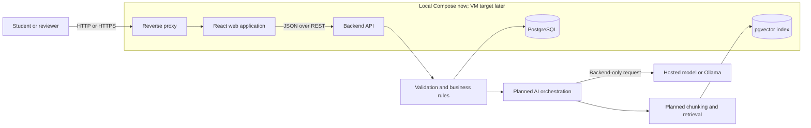

# Final Project Planning Baseline

## Current status

**Checkpoint: end of Week 3 / 8.** CourseMate AI has a runnable React–NestJS–PostgreSQL vertical slice and a reproducible local container setup. The team has not yet implemented the AI/RAG workflow or deployed to the target virtual machine. The model provider, VM, team member names, and official LMS dates remain open decisions.

This plan is intentionally scoped for two students who are also completing other course projects. The goal is a small, complete and explainable product, not a broad platform.

## Course requirements treated as project requirements

- Build a small but complete web or mobile vertical slice.
- Provide a usable frontend workflow.
- Provide a backend API with validation and business logic.
- Store persistent data.
- Integrate one meaningful LLM-powered capability through the backend.
- Select one advanced AI track and provide technical evidence.
- Include at least ten AI evaluation cases.
- Handle loading, invalid output, timeout, and unavailable-dependency states.
- Provide a reproducible setup and a containerized deployment.
- Maintain tests, architecture documentation, an AI usage log, and evidence of human review.
- Submit the repository, final revision, architecture diagram, presentation, backup demo, and individual contribution statements.
- Ensure both members can explain the architecture, code paths, data flow, design choices, tests, and failure handling.

Exact deadlines, approved technology lists, API access rules, and grade percentages in the LMS take precedence over this plan.

## Product definition

### CourseMate AI

A web workspace for a two-person student team to manage project tasks and ask questions about a controlled collection of course and project documents. The assistant will return answers grounded in retrieved passages and display citations. The non-AI workflow remains useful when the model is unavailable.

### Target users

- Student teams working on a course project.
- A lecturer or reviewer who needs to inspect project evidence.

### Product value

The application keeps project tasks, evidence, and course knowledge in one place. It helps the team retrieve requirements quickly while preserving the source passage used for each AI answer.

## Minimum successful vertical slice

One team member opens a workspace, selects or uploads an approved document, creates a project task, asks the assistant a question, receives a cited answer, opens the cited passage, and sees a clear fallback when the model or retrieval dependency is unavailable.

The complete scenario should fit within a short live demonstration and be reproducible from the submitted README.

## MVP scope

### Conventional application

- One team workspace.
- Document metadata and ingestion status.
- Task creation, assignment, status update, and due date.
- A small activity or evidence log for important actions.
- Form validation and clear loading, empty, success, and error states.
- Persistent PostgreSQL data.

### AI capability

- Backend-only model access.
- Retrieval-augmented question answering over a controlled document collection.
- Answer citations linked to stored document chunks.
- Refusal or an explicit unanswerable result when evidence is insufficient.
- A versioned prompt stored in the repository.
- At least ten evaluation cases covering normal, ambiguous, irrelevant, unanswerable, long, invalid, unsafe, timeout, unavailable-model, and malformed-output scenarios.

### Non-AI fallback

Users can search document titles, browse stored passages, and manage tasks while AI is unavailable.

## Deliberately out of scope

- Multiple organizations or complex role-based access control.
- Autonomous multi-step agents.
- Payments, social feeds, or real-time collaboration.
- A separate native mobile application.
- Kubernetes or a microservice architecture.
- More than one advanced AI track before the release gate.

## Technology baseline

- Frontend: React, TypeScript, and Vite.
- Backend: Node.js with NestJS.
- Database: PostgreSQL with pgvector for embeddings and relational data.
- AI model interface: provider-neutral backend adapter supporting an approved hosted model or Ollama.
- Document processing: an ingestion worker kept inside the API service for the MVP.
- Containers: Dockerfiles plus Docker Compose.
- Deployment: Ubuntu Server LTS virtual machine with Docker Engine, Compose, and Caddy or Nginx as the reverse proxy.
- CI: lint, unit tests, API tests, and container build after the local vertical slice is stable.

## Current architecture

## Security and failure boundaries

- Never place model credentials or database secrets in frontend code or Git history.
- Validate every API request and every structured model response.
- Limit uploaded file types and file sizes.
- Treat retrieved document text as untrusted input.
- Use timeouts and bounded retries for model calls.
- Return a safe fallback when retrieval, database, or model dependencies fail.
- Keep request IDs and structured logs without storing secrets or unnecessary personal data.

## Eight-week delivery plan

### Weeks 1–2 — completed planning baseline

- Confirm the problem, target users, product name, and React-based web direction.
- Define the controlled-document assistant concept and the short demonstration.
- Draft the architecture, data entities, API boundary, evaluation cases, and team ownership model.

Evidence: project brief, architecture document, planning baseline, evaluation plan, and AI usage log.

### Week 3 — completed technical baseline

- Build the first React navigation and task workspace.
- Implement task API endpoints, DTO validation, persistence, health checks, and tests.
- Add PostgreSQL/pgvector initialization and Docker Compose for web, API, and database.
- Verify build, typecheck, tests, container health, valid CRUD, and invalid-input behavior.

Evidence: runnable local stack and the current milestone record in `docs/week-01.md`.

### Week 4 — team ownership and document foundation

- Both members independently run and explain the baseline.
- Each member makes one small cross-layer change and reviews the other change.
- Implement document metadata, upload constraints, and extraction for one selected format.

Exit evidence: document stored with an ingestion status and both members able to trace one request.

### Week 5 — retrieval assistant baseline

- Implement chunking and embeddings for the controlled corpus.
- Store and retrieve relevant chunks with pgvector.
- Connect one approved model through the backend.
- Return a first answer with source identifiers.

Exit evidence: one grounded question-answer trace from document to citation.

### Week 6 — reliability and evaluation

- Add structured output validation, prompt versioning, timeouts, and unavailable-service fallback.
- Execute the ten evaluation cases and record latency and pass/fail results.
- Test irrelevant questions, unanswerable questions, malformed output, and prompt injection.

Exit evidence: evaluation table, failure evidence, and updated AI usage log.

### Week 7 — deployment and release candidate

- Deploy the same Compose stack to the selected Ubuntu VM.
- Verify restart recovery, logs, configuration, and secret handling.
- Fix the highest-risk defects and freeze features after the release gate.

Exit evidence: release-candidate revision, deployment proof, and final RAG trace.

### Week 8 — presentation and technical defense

- Fix defects only; avoid new feature work.
- Update the architecture diagram to match the code.
- Prepare slides, a short backup video, contribution statements, and likely questions.
- Rehearse the end-to-end scenario and random-member code explanation.

Exit evidence: final release, presentation, backup demo, evaluation results, and individual reflections.

## Two-person responsibility model

### Tài primary ownership

- Frontend architecture and user experience.
- Form validation and frontend tests.
- Demo flow and presentation visuals.

### Thắng primary ownership

- Backend API, database, and deployment.
- AI integration, retrieval, and evaluation harness.
- Logs, health checks, and container operation.

### Shared responsibility

- Every pull request has the other member as reviewer.
- Both members implement at least one change outside their primary area.
- Both members rehearse the full request path and AI execution trace.
- Both members maintain their own contribution and reflection evidence.

## Decisions still open before AI integration

1. Final product topic details and controlled document corpus.
2. Model provider: approved hosted API, Ollama, or a documented fallback.
3. VM platform and deployment target.
4. Exact final deadline and official LMS constraints.

## Initial risk register

- Generic chatbot scope may not demonstrate meaningful application value. Mitigation: ground the assistant in a real workflow and controlled documents.
- Local models may be slow on student hardware. Mitigation: keep a provider adapter and record a hosted fallback.
- RAG quality may be inconsistent. Mitigation: use a small controlled corpus, citations, an unanswerable policy, and a fixed evaluation set.
- Deployment work may consume feature time. Mitigation: validate the VM by Week 7 and keep the stack as a modular monolith.
- One member may become the only system expert. Mitigation: mandatory cross-review, shared runbooks, and random technical-defense rehearsal.
- Late scope growth may destabilize the demo. Mitigation: freeze features after Week 7 and reserve Week 8 for defects, evidence, and rehearsal.
